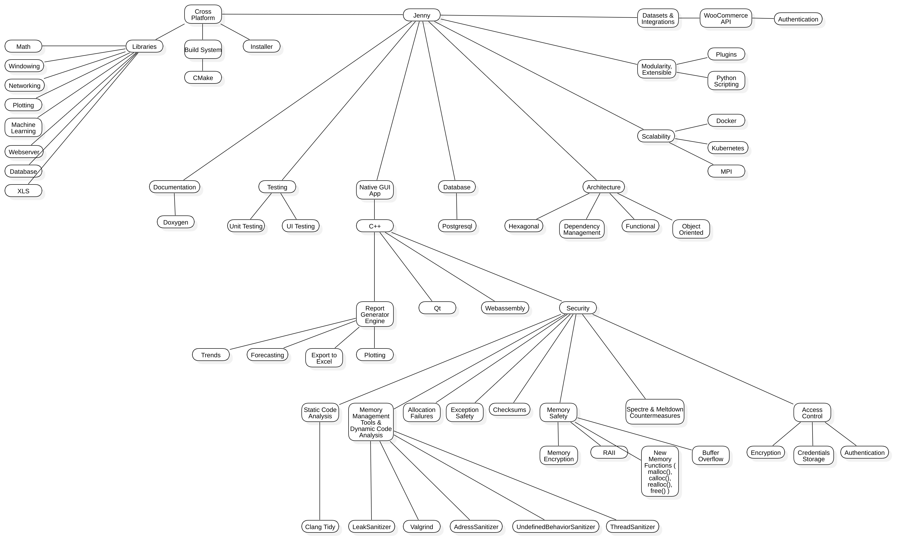
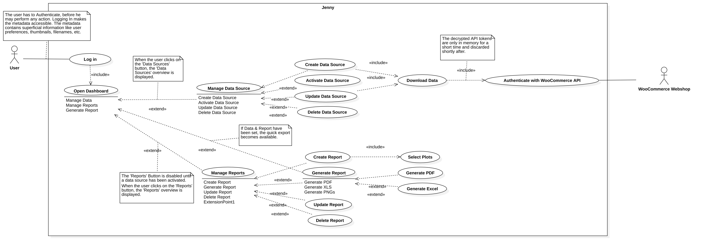
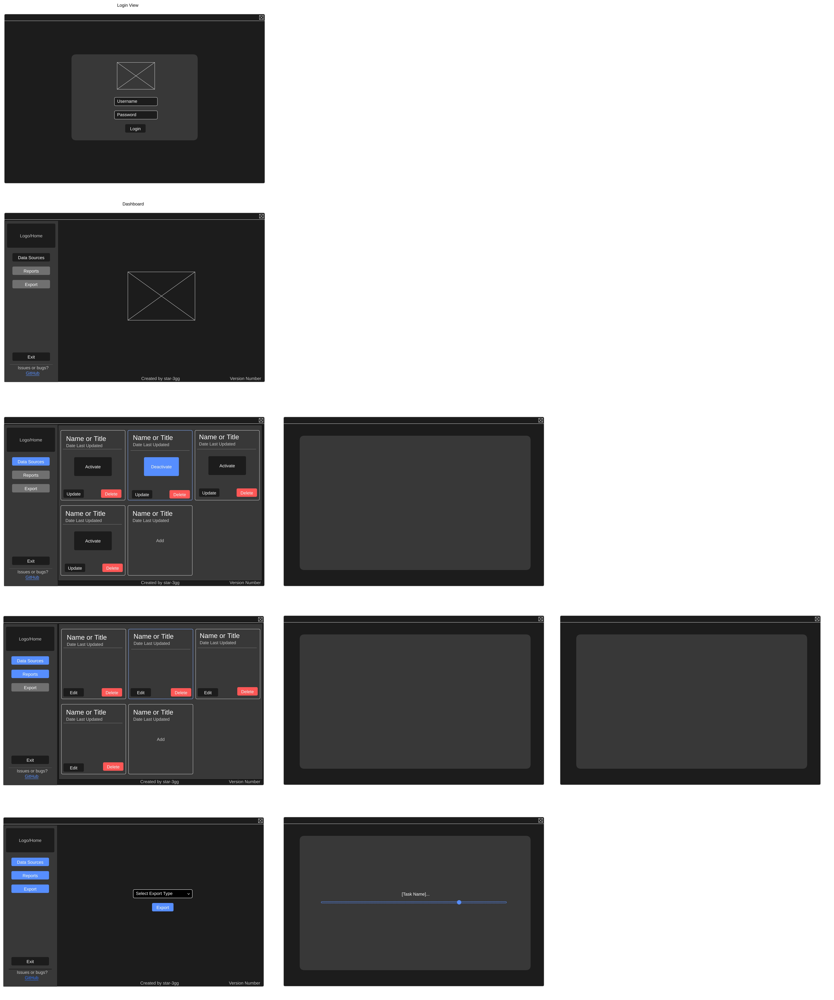

# Jenny — Automated Statistics Generator and Prediction Engine 📊

<!-- START LOGO -->

<!-- END LOGO -->

A data science toolkit for marketing teams.

# Introduction
Welcome to Jenny, your go-to platform for automated statistics and predictive analytics. Designed for marketing teams, Jenny simplifies data science tasks, providing insights and forecasts to drive strategic decisions. 🚀

## Getting started
Get Jenny up and running on your machine. Here's how to install it on different operating systems (currently, Linux support is experimental):

### Installation on Linux (experimental)
- For development simply run `docker-compose up` to build the project and proceed to run the binary in the build folder by executing `./build/<built-binary-name>`.

- [Instructions coming soon...]

### Installation on MacOS (soon)
- [Instructions coming soon...]

### Installation on Windows10 (soon)
- [Instructions coming soon...]

# Design & Concept
Dive into the design and thought process behind Jenny. This section outlines the key concepts, architecture, and user experience design of the application.

## Mindmap
Get a bird's eye view of the project's structure and its various components with our mindmap.

<!-- START MINDMAP -->

<!-- END MINDMAP -->

## Use-Case Diagram
Understand how users interact with Jenny and the different functionalities it offers through our use-case diagram.

<!-- START USE-CASE DIAGRAM -->

<!-- END USE-CASE DIAGRAM -->

## Wireframes
Visualize the user interface and experience with our detailed wireframes, mapping out the look and feel of Jenny.

<!-- START UI WIREFRAMES -->

<!-- END UI WIREFRAMES -->

## Deployment
Jenny is a work in progress. Stay tuned for deployment instructions and more! 🏗️

# Contribution
We welcome contributions from data scientists, developers, and marketing professionals. If you're interested in contributing to Jenny, please check out our [contribution guidelines](CONTRIBUTING.md).

# License
Jenny is open-source software, licensed under the [GPLv3](LICENSE).
